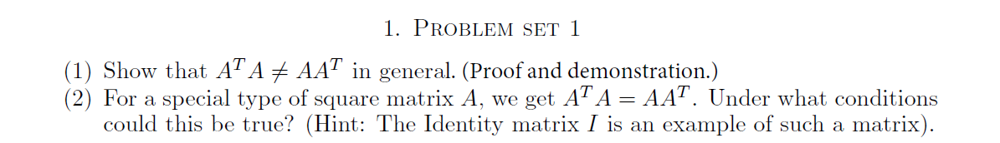

### Question 1 :

```{r}
A = matrix(seq(1, 9), nrow=3, byrow = T)
AT = matrix(seq(1, 9), nrow=3, byrow = F)
```

$$\left[\begin{array}
{rrr}
1 & 2 & 3 \\
4 & 5 & 6 \\
7 & 8 & 9
\end{array}\right] *
\left[\begin{array}
{rrr}
1 & 4 & 7 \\
2 & 5 & 8 \\
3 & 6 & 9
\end{array}\right] =
$$

```{r}
A %*% AT
```

$$
\left[\begin{array}
{rrr}
1 & 4 & 7 \\
2 & 5 & 8 \\
3 & 6 & 9
\end{array}\right] *
\left[\begin{array}
{rrr}
1 & 2 & 3 \\
4 & 5 & 6 \\
7 & 8 & 9
\end{array}\right] =
$$

```{r}
AT %*% A
```

```{r}
(AT %*% A) == (A %*% AT)
```


 
### Question 2 :

$A^T A = A A^T$ is true if $A$ is a diagonal matrix.So An identity matrix when transposed and multiplied to itself, are equal to each other.

Let $A = \begin{bmatrix} a & 0 & 0 \\ 0 & b & 0 \\ 0 & 0 & c \end{bmatrix}$ then
$A^T = \begin{bmatrix} a & 0 & 0 \\ 0 & b & 0 \\ 0 & 0 & c \end{bmatrix}$ therefore:
$$
A^T A =
\begin{bmatrix} a & 0 & 0 \\ 0 & b & 0 \\ 0 & 0 & c \end{bmatrix}
\begin{bmatrix} a & 0 & 0 \\ 0 & b & 0 \\ 0 & 0 & c \end{bmatrix} =
\begin{bmatrix} a^2 & 0 & 0 \\ 0 & b^2 & 0 \\ 0 & 0 & c^2 \end{bmatrix}
$$
$$
A A^T =
\begin{bmatrix} a & 0 & 0 \\ 0 & b & 0 \\ 0 & 0 & c \end{bmatrix}
\begin{bmatrix} a & 0 & 0 \\ 0 & b & 0 \\ 0 & 0 & c \end{bmatrix} =
\begin{bmatrix} a^2 & 0 & 0 \\ 0 & b^2 & 0 \\ 0 & 0 & c^2 \end{bmatrix}
$$
This gives a case when $A^T A = A A^T$ is true.

```{r}
A = matrix(c(1, 0, 0, 1), nrow=2, byrow = T)
AT = t(A)
(A %*% AT) == (A %*% AT)
```

