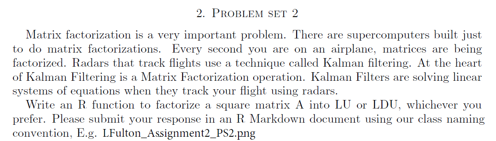

Write an R function to factorize a square matrix $A$ into LU or LDU, whichever you prefer.


```{r setup, include=FALSE}
knitr::opts_chunk$set(echo = TRUE)
knitr::opts_chunk$set(tidy = TRUE)
knitr::opts_chunk$set(warning = FALSE)
load_package <- function(x) {
  if(!require(x, character.only = T)) install.packages(x, dependencies = T, repos = "http://cran.us.r-project.org")
  require(x, character.only = T)
}
libs <- c("knitr", "magrittr", "data.table", "kableExtra", "tidyverse", "matlib")
lapply(libs, load_package)
```

## Function Set-Up
```{r,include =TRUE}
lu_function <- function(m) {
  mDims <- dim(m)
  
  # check for square matrix
  if (mDims[1] != mDims[2]) return(NA)
  
  U <- m
  n <- mDims[1]
  L <- diag(n)
  
  # if dim is 1, the U=A and L=[1]
  if (n == 1) return(list(L, U))
  
  # loop through lower triangle
  # determine multiplier
  for(i in 2:n) {
    for(j in 1:(i - 1)) {
      multiplier <- -U[i, j] / U[j, j]
      U[i, ] <- multiplier * U[j, ] + U[i, ]
      L[i, j] <- -multiplier
    }
  }
  
  return(list(L,U))
}
```

## Function Example
```{r}
m1 <- matrix(seq(1, 9), nrow = 3)
m2 <- matrix(sample(1:100, 9, replace=T), nrow = 3)
ms <- list(m1, m2)
lus <- ms %>%
  map(lu_function) %>%
  print
m1 == lus[[1]][[1]] %*% lus[[1]][[2]]
m2 == lus[[2]][[1]] %*% lus[[2]][[2]]
```